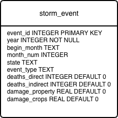
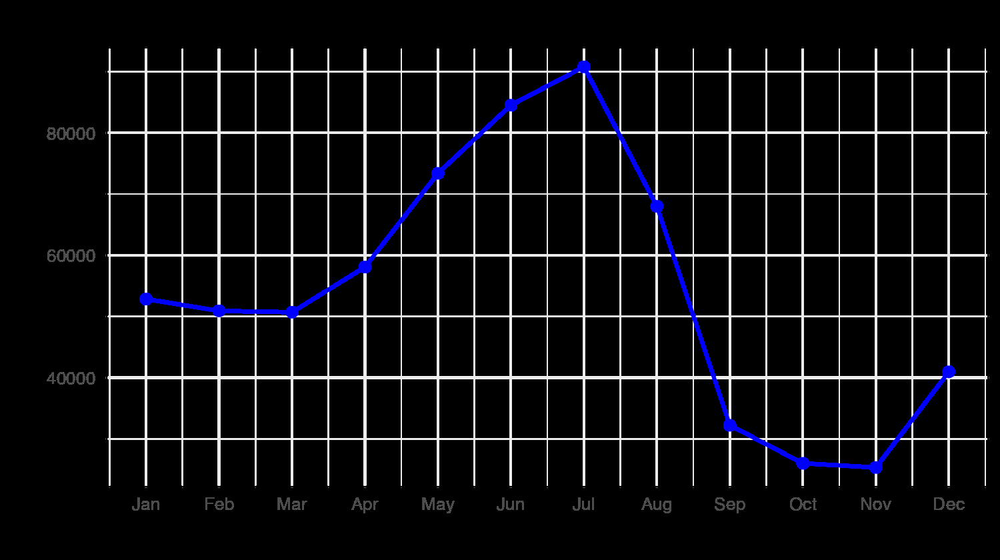
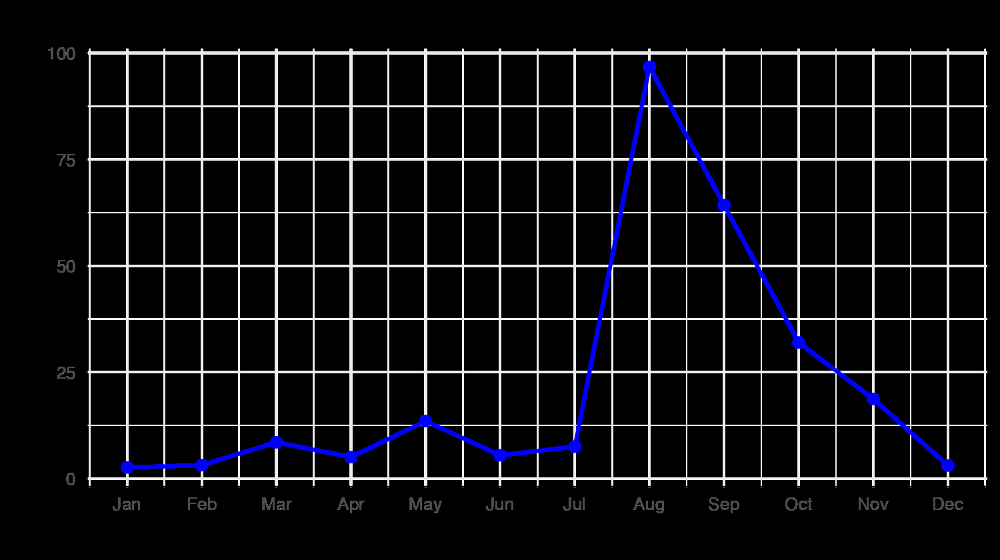
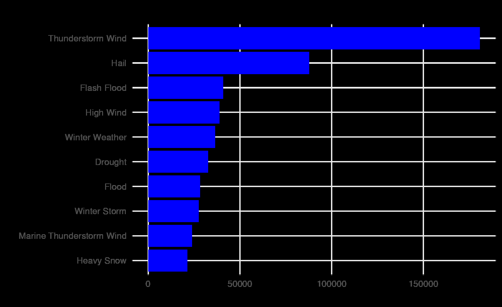
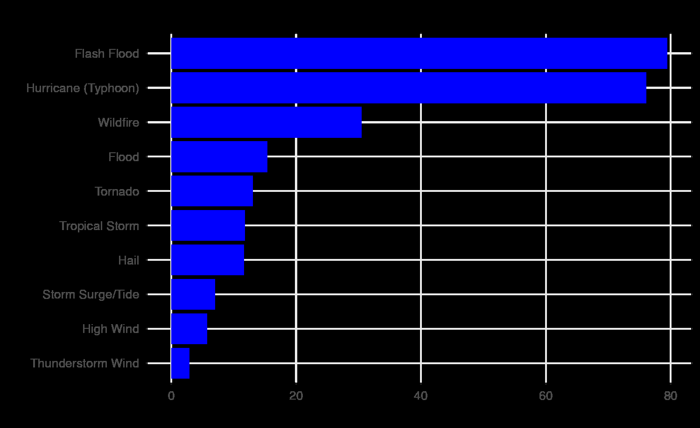
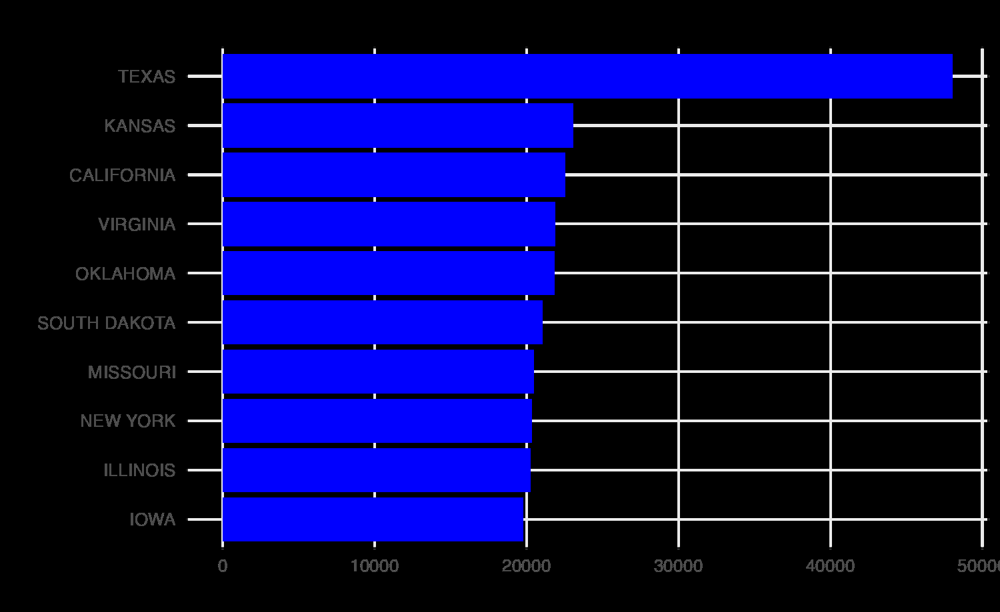
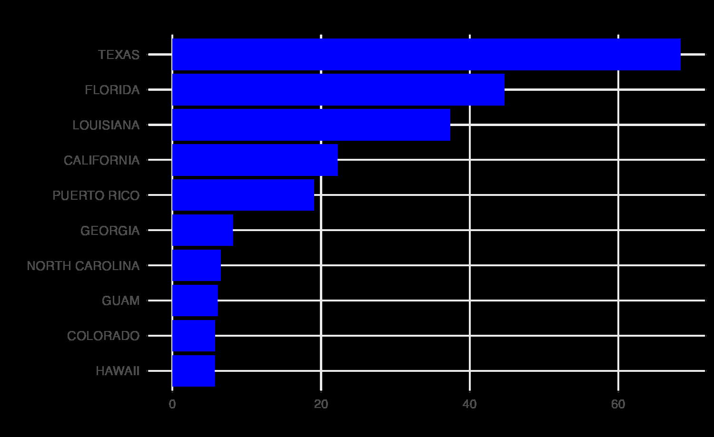
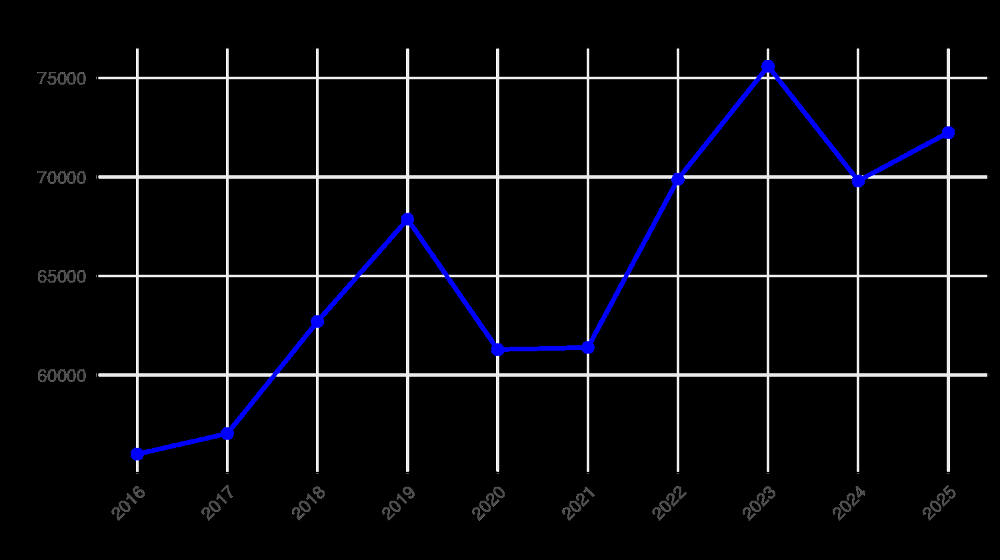
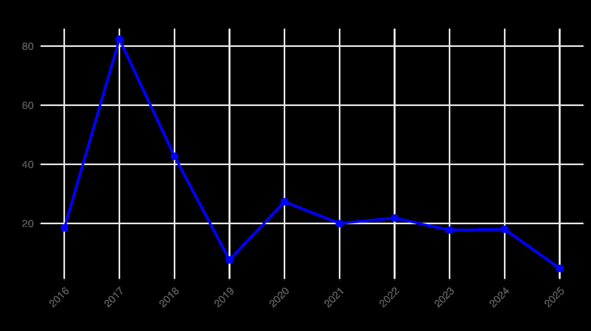

# NOAA Storm Events Data Management & Risk Analysis

A reproducible **R + SQL + SQLite** data-management pipeline for analyzing U.S. NOAA Storm Events from **2016–2025**. The project downloads annual event-level files, cleans and standardizes the data, builds an indexed SQLite database, runs analytical SQL summaries, and generates tables and visualizations for seasonal, event-type, geographic, and yearly risk patterns.

## Project highlights

- Processed **653,801 storm-event records** across 10 annual NOAA files.
- Built a reproducible **SQLite database** with indexes on year, month, state, and event type.
- Developed an automated **R + SQL pipeline** for download, cleaning, transformation, database loading, querying, and visualization.
- Analyzed **10,046 fatalities** and approximately **$260.7B in reported property and crop damage**.
- Compared storm **frequency vs. impact** across months, event types, states, and years.
- Reproduces the workflow from the command line with a single shell script.

## Technology

**R** · **SQL** · **SQLite** · **RSQLite** · **DBI** · **dplyr** · **readr** · **ggplot2** · **janitor** · **Bash**

## Data pipeline

```text
NOAA annual Storm Events files (2016–2025)
                    │
                    ▼
         scripts/build_database.R
      download • clean • standardize
      convert damage • remove duplicates
                    │
                    ▼
     SQLite: storm_events_2016_2025.sqlite
        indexed analytical event table
                    │
             SQL aggregation
                    ▼
          scripts/make_figures.R
                    │
             ┌──────┴──────┐
             ▼             ▼
       summary CSVs    PNG figures
```

## Database design

The analytical database uses a single event-level table. `event_id` is the primary key; `year`, `month_num`, `state`, and `event_type` are indexed because they are repeatedly used for grouping and filtering.



### Core fields

| Field | Purpose |
|---|---|
| `event_id` | Unique event identifier / primary key |
| `year` | Event year |
| `begin_month` | Event month name |
| `month_num` | Numeric month for chronological ordering |
| `state` | State or territory |
| `event_type` | NOAA event classification |
| `deaths_direct` | Direct fatalities |
| `deaths_indirect` | Indirect fatalities |
| `damage_property` | Standardized property damage in dollars |
| `damage_crops` | Standardized crop damage in dollars |

## Data cleaning

The database-building script performs the following transformations:

1. Downloads NOAA annual detail files for 2016–2025 when they are not already available locally.
2. Standardizes field names with `janitor::clean_names()`.
3. Retains the fields needed for the analytical questions.
4. Derives numeric month values to preserve January–December ordering.
5. Converts NOAA damage strings with `K`, `M`, and `B` suffixes into numeric dollar values.
6. Replaces missing death counts with zero and converts death fields to integers.
7. Removes duplicate `event_id` values before loading the database.
8. Creates indexes to support repeated analytical grouping operations.

## Research questions

The analysis addresses four questions:

1. **Seasonality:** How do event counts, fatalities, and total reported damage vary by month?
2. **Frequency vs. impact:** Which event types occur most often, and which are associated with the largest fatalities and damages?
3. **Geographic risk:** Which states have the highest event counts, fatalities, and damages?
4. **Ten-year patterns:** How do event counts, fatalities, and reported damage vary from 2016 through 2025?

## Key results

| Measure | Result |
|---|---|
| Total event records | **653,801** |
| Total fatalities | **10,046** |
| Total reported damage | **$260.7B** |
| Peak event month | **July — 90,790 events** |
| Peak damage month | **August — $96.7B** |
| Most frequent event type | **Thunderstorm Wind — 180,798 records** |
| Highest-fatality event type | **Excessive Heat — 2,190 deaths** |
| Highest-damage event type | **Flash Flood — $79.5B** |
| State with most events | **Texas — 48,031** |
| State with highest fatalities | **Arizona — 2,800** |
| State with highest damage | **Texas — $68.4B** |
| Highest event-count year | **2023 — 75,593 events** |
| Highest damage year | **2017 — $82.3B** |

The central analytical finding is that **frequency and impact describe different dimensions of storm risk**. High-frequency hazards dominate the number of records, while a smaller set of high-impact hazards accounts for disproportionate fatalities and economic losses.

## Selected visualizations

### Seasonal patterns

| Event records by month | Reported damage by month |
|---|---|
|  |  |

July has the highest event count, while reported damage peaks in August, illustrating that the busiest months are not necessarily the costliest.

### Event frequency vs. impact

| Most frequent event types | Largest damage by event type |
|---|---|
|  |  |

Thunderstorm Wind dominates event frequency, whereas Flash Flood accounts for the largest total reported damage.

### Geographic patterns

| States by event count | States by reported damage |
|---|---|
|  |  |

Texas leads both event count and total reported damage, while the broader state rankings change depending on whether frequency, fatalities, or economic losses are measured.

### Ten-year patterns

| Annual event records | Annual reported damage |
|---|---|
|  |  |

Annual totals fluctuate substantially. The largest event count occurs in 2023, while the largest damage total occurs in 2017.

## Repository structure

```text
noaa-storm-events-data-management/
├── README.md
├── .gitignore
├── scripts/
│   ├── build_database.R
│   ├── make_figures.R
│   └── run_all.sh
├── sql/
│   ├── schema.sql
│   └── queries.sql
└── images/
    ├── database_erd.png
    └── selected analysis figures
```

Generated and downloaded files are intentionally excluded from version control:

```text
data/      # downloaded NOAA annual files
output/    # generated SQLite database
 tables/   # generated summary CSVs
figures/   # figures regenerated by the R workflow
```

The selected images in `images/` are retained as portfolio previews so the results are visible directly on GitHub.

## Reproduce the project

### Requirements

- R
- Bash-compatible terminal
- Internet connection for the initial NOAA data download

The scripts install missing R packages automatically. From the repository root, run:

```bash
bash scripts/run_all.sh
```

The workflow will:

1. download the NOAA annual detail files,
2. clean and combine the records,
3. build `output/storm_events_2016_2025.sqlite`,
4. create analytical indexes,
5. query the SQLite database,
6. write summary CSV files to `tables/`, and
7. generate plots in `figures/`.

## SQL examples

The repository includes reusable SQL summaries for monthly, event-type, state, and yearly analysis. For example:

```sql
SELECT
  event_type,
  COUNT(*) AS events,
  SUM(deaths_direct + deaths_indirect) AS fatalities,
  SUM(damage_property + damage_crops) AS damage
FROM storm_events
GROUP BY event_type
ORDER BY events DESC;
```

See [`sql/queries.sql`](sql/queries.sql) for the complete analytical query set and [`sql/schema.sql`](sql/schema.sql) for the database schema and indexes.

## Data source

Data are obtained from the **NOAA National Centers for Environmental Information (NCEI) Storm Events Database** annual detail files. The raw files are not committed to this repository; `build_database.R` downloads them as part of the reproducible workflow.

## Limitations

Storm-event records represent reported events rather than a direct count of all storms. Reporting practices can vary by time, location, and event type. NOAA damage estimates may also be rounded, incomplete, or revised. The 2016–2025 period is useful for examining recent patterns but is not sufficient by itself for conclusions about long-term climate trends.

## Author

**Thong Cu**  
University of Connecticut  
Data Management project
